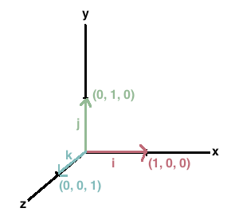

# Tensorflow dev certificate training

Notes from the udemy course by "zero to mastery".

<!-- START doctoc generated TOC please keep comment here to allow auto update -->
<!-- DON'T EDIT THIS SECTION, INSTEAD RE-RUN doctoc TO UPDATE -->
**Table of Contents**

- [Own notes](#own-notes)
  - [Setting up a nvidia GPU enabled tensorflow docker + jupyter in Linux Mint](#setting-up-a-nvidia-gpu-enabled-tensorflow-docker--jupyter-in-linux-mint)
  - [How to export colab notebook to markdown](#how-to-export-colab-notebook-to-markdown)
  - [Upgrade Tensorflow version in google colab (default is 2.9.2, this upgrades currently to 2.11)](#upgrade-tensorflow-version-in-google-colab-default-is-292-this-upgrades-currently-to-211)
- [Deep learning and TensorFlow fundamentals](#deep-learning-and-tensorflow-fundamentals)
  - [What is deep learning](#what-is-deep-learning)
  - [Why use deep learning](#why-use-deep-learning)
    - [What deep learning is good for:](#what-deep-learning-is-good-for)
    - [What deep learning is **NOT** good for:](#what-deep-learning-is-not-good-for)
    - [ML / DL differences](#ml--dl-differences)
    - [Common algorithms in ML and DL](#common-algorithms-in-ml-and-dl)
  - [What are neural networks?](#what-are-neural-networks)
    - [Steps in nn learning:](#steps-in-nn-learning)
    - [The neural network redux](#the-neural-network-redux)
    - [Types of learning](#types-of-learning)
  - [What is DL already used for?](#what-is-dl-already-used-for)
    - [Common usecases](#common-usecases)
    - ["New" usecases and breakthroughs](#new-usecases-and-breakthroughs)
  - [What is and why use TensorFlow?](#what-is-and-why-use-tensorflow)
    - [What is Tensorflow?](#what-is-tensorflow)
    - [Why TensorFlow](#why-tensorflow)
  - [What is a Tensor?](#what-is-a-tensor)
    - [Exkurs: Notes on Video what is a tensor? by Dan Fleisch](#exkurs-notes-on-video-what-is-a-tensor-by-dan-fleisch)
      - [Vectors](#vectors)
      - [Finding vector components / projecting](#finding-vector-components--projecting)
      - [Finally: tensors](#finally-tensors)
  - [Course information](#course-information)
  - [Section 15 - 37](#section-15---37)
- [Neural Network Regression with TensorFlow](#neural-network-regression-with-tensorflow)
  - [Introduction](#introduction)
  - [Inputs and outputs of a neural network regression model](#inputs-and-outputs-of-a-neural-network-regression-model)
  - [Anatomy and architecture of a neural network regression model](#anatomy-and-architecture-of-a-neural-network-regression-model)

<!-- END doctoc generated TOC please keep comment here to allow auto update -->

## Own notes

### Setting up a nvidia GPU enabled tensorflow docker + jupyter in Linux Mint

    curl -s -L https://nvidia.github.io/nvidia-docker/gpgkey | sudo apt-key add -
    curl -s -L https://nvidia.github.io/nvidia-docker/ubuntu20.04/nvidia-docker.list | sudo tee /etc/apt/sources.list.d/nvidia-docker.list
    sudo apt update
    sudo apt install  nvidia-container-toolkit
    
    sudo systemctl restart docker
    
    docker pull tensorflow/tensorflow:latest-gpu-jupyter
    
    # test
    docker run --gpus all -it --rm tensorflow/tensorflow:latest-gpu-jupyter     python -c "import tensorflow as tf; print(tf.reduce_sum(tf.random.normal([1000, 1000])))"

### [How to export colab notebook to markdown](https://www.youtube.com/watch?v=wxUzUxQGEs4)

### Upgrade Tensorflow version in google colab (default is 2.9.2, this upgrades currently to 2.11)

`!pip install --upgrade tensorflow`

## Deep learning and TensorFlow fundamentals

### What is deep learning

- Machine learning: turning data into numbers and **finding patterns** in those numbers. 
- Deep learning: subset of machine learning based on neural networks and multiple layers of processing to extract progressively higher level features from data

"Traditional" programming vs ML algorithm: 

- Traditional applies rules to get to an output
- ML figures out rules from a given input and existing ideal output (training)

### Why use deep learning

It's hard to impossible to figure out all the rules for a complex problem, e.g. self-driving cars, image recognition

#### What deep learning is good for:

- Problems with long lists of rules
- Continually changing environments where DL can adapt to new scenarios
- Discovering insights within large collections of data that are impossible to hand-craft as rules, e.g object recognition


#### What deep learning is **NOT** good for:

- when explainability is needed (ML patterns can't be interpreted by humans)
- If a **simple rule-based system** can be used to solve a problem, do that instead of using ML (from [rules of ml](https://developers.google.com/machine-learning/guides/rules-of-ml))
- When errors are unacceptable
- When not much data exists about the problem

#### ML / DL differences

- ML works best on **structured data**, e.g. tables with columns (=features)
- DL performs better on unstructured data such as natural language texts or images

#### Common algorithms in ML and DL

ML:

These are also called "shallow algorithms" 

- random forest
- naive bayes
- nearest neighbour
- support vector machine
- ...many more

DL:

- Neural networks
- fully connected neural network
- convolutional neural network
- recurrent neural network
- transformer
- ...many more

### What are neural networks?

Network or circuit of (artificial) neurons or nodes

#### Steps in nn learning:

- turn inputs / data into numbers (numerical encoding); 
- feed the numbers into a neural network for it to learn representation (= find patterns, features, weights in these numbers)
- network creates / derives representation outputs
- Take representation outputs and convert them into human understandable outputs, e.g. "this picture is of spagghetti", "this soundwave contains the sentence "hey siri, what's up""

#### The neural network redux


- Data goes into the input layer
- hidden layers / hidden neurons learn patterns in the data
  - other terms for "patterns": embedding, weights, feature representation, feature vectors
- output layer outputs the learned representations or prediction probabilities

#### Types of learning

- supervised learning: learn from existing data and labels (e.g. a list of images and associated labels such as "Ramen", "Steak" etc.)
- semi-supervised learning: only has *some* labels for the data
- unsupervised learning: only data exists; the nn tries to figure out patterns within the data
- transfer learning: use patterns from an existing *model* (= the output of a neural network / machine learning algo) and try to apply it to other problems / set of data, e.g. 

### What is DL already used for?

- literally anything as long as the input can be converted into numbers

#### Common usecases

- recommendation systems (e.g. youtube recommendations)
- translation (**sequence to sequence** = **seq2seq**, sequence of words gets transformed / translated to another sequence)
- speech recognition (also seq2seq)
- computer vision (**classification / regression**)
- natural language processing (NLP), e.g. "is this mail spam?" (classificatoin / regression)

#### "New" usecases and breakthroughs

- Protein folding for medical research
- ChatGPT
- creating images from commands

### What is and why use TensorFlow?

http://tensorflow.org

#### What is Tensorflow?

- End-to-end deep learning platform
- Write fast (gpu/tpu enabled) deep learning code in python or other accessible languages
- access many pre-built DL models via Tensorflow hub
- whole stack: preprocess data, model data, deploy model in appllication
- originally designed for in-house use by google, now open source

#### Why TensorFlow

- easy model building with high-level APIs
- easy to experiment with
 
### What is a Tensor?

A Tensor is the numerical encoding of information (e.g. images, a text etc.), as well as the *output* - the patterns the neural network has learned - of the neural network.

  
*this is the "flow" in tensor flow*

#### Exkurs: Notes on Video [what is a tensor?](https://www.youtube.com/watch?v=f5liqUk0ZTw) by Dan Fleisch

##### Vectors

- Vectors: an "arrow" having magnitude and direction (length = magnitude, orientation = direction). Vectors can represent velocity, the direction and magnitude of the earths magnetic field, an area (length = square meters, direction = perpendicular to the area) etc.
- Vectors are members of a wider class called Tensors.

In a cartesian coordinate system there exist **basis vectors** (or *unit vectors*) of the length of one unit (whatever unit the vectors are measured in), one for each direction of the coordinate axis, e.g. x, y, z. These are often represented with a "hat", e.g. ẑ for the z unit vector (pronounced z-hat).



##### Finding vector components / projecting

To find the vector components (e.g. the x/y coordinates of the "tip" of the vector with its root in x:0, y:0 in a 2d system) we project the vector on each of its axis'.


A vector can thus be represented by its vector components, e.g. points on the x and y axis such as `[3,4]` as the vector always starts at 0,0 and the magnitude / length of the vector can be derived from these (`a^2 + b^2 = c^2`). 

##### Finally: tensors

>Scalars and vectors are special cases of tensors.  
>The types of tensors that are easiest to think about are rank-0 (scalars), rank-1 (vectors), and rank-2 (you can loosely think of a rank-2 tensor as a 3x3 matrix in this context).

*(some person on reddit)* 


### Course information

Topics covered:

- tensorflow basics
- preprocessing data
- building / using deep learning models
- fitting a model to data
- making predictions with a model (*using* the patterns)
- evaluate model predictions
- saving and loading models
- using a trained model to make predictions on custom data (*new* data sets)

Workflow:


How to approach this course:

- write code / follow along
- explore and experiment; figure out what works and what doesn't
- visualize (recreate in a way you can understand)
- ask questions
- do the exercises
- share your work (doing that with this readme)
- don't overthink the process
- Intelligence is a result of knowledge, so there's no "I can't learn it"

### Section 15 - 37

**All notes and images in notebook with comments for ch02 section 15 + in [colab_notebooks/00_tensorflow_fundamentals.ipynb](./colab_notebooks/00_tensorflow_fundamentals.ipynb)**

Site used for coding: https://colab.research.google.com/

Useful commands:

`strg-enter`: run current cell
`alt-enter`: run cell and inster new
`strg-F9`: run all cells
`strg-F8`: run all cells before current
`strg-m b`: open new code cell below
`strg-m `: run current cell
`strg-m d`: delete cell
`strg-m y`: convert to code cell
`strg-m m`: convert to text cell
`shift-strg-space`: show docstring

In IntelliJ, use `esc` instead of `strg-m` for command mode.

## Neural Network Regression with TensorFlow

### Introduction 

What is a regression problem?

Examples:

- **How much** will this house sell for?
- **How many** people will buy this app?
- **How much** will my health insurance be?
- **How much** should I save each week for fuel?

Regression problems predict a number of some sort (quantitative, coordinates or any other that can be turned into numbers). 

>In statistical modeling, regression analysis is a set of statistical processes for estimating the relationships between a dependent variable (often called the 'outcome' or 'response' variable, or a 'label' in machine learning parlance) and one or more independent variables (often called 'predictors', 'covariates', 'explanatory variables' or 'features').

https://en.wikipedia.org/wiki/Regression_analysis

Example: house price (outcome / dependent variable / label) depends on the independent variables (predictors / features / covariates) number of bedrooms, age, neighborhood etc.

**What is being covered**

- Architecture of a neural network regression model
- Input and output shapes of a regression model (features and labels)
- Creating custom data to view and fit
- Steps in modelling
  - Creating a model
  - Compiling a model
  - Fitting a model
  - Evaluation a model
- Different evaluation methods
- Saving and loading models

### Inputs and outputs of a neural network regression model

**Example: Sale price house**

Inputs:

- Number of bedrooms: 4
- Number of bathrooms: 2
- Number of garages: 2

Encoding (one-hot):

```
  1  2  3  4
[[0, 0, 0, 1], # bedrooms
 [0, 1, 0, 0], # bathrooms
 [0, 1, 0, 0] # garages
] 
```

*pkro: but why one-hot encode quantitative variables? Maybe not the best example or it will be clarified in the course later*

Output: Price


**Input and output shapes**

Input:

`[bedroom, bathroom, garage]` (Tensor of shape `[3]`)

Output:

`[939700]` Shape=`[1]`


### Anatomy and architecture of a neural network regression model

**Hyperparameter: typical value**

1) **Input layer shape**:        Same shape as number of features, e.g. 3 for the house example
2) **Hidden layer(s)**:          Problem specific, min=1, max=unlimited
3) **Neurons per hidden layer**: Problem specific, usually 10-100
4) **Output layer shape**:       Same shape as desired prediction shape, e.g. 1 for house price
5) **Hidden activation**:        Usually [ReLU](https://machinelearningmastery.com/rectified-linear-activation-function-for-deep-learning-neural-networks/) = Rectified Linear Unit
6) **Output activation**:        None, ReLU, logistic/tanh
7) **Loss function**:            How wrong are the predictions? [MSE](https://www.statisticshowto.com/probability-and-statistics/statistics-definitions/mean-squared-error/) (mean squared error), [MAE](https://www.statisticshowto.com/absolute-error/) (mean absolute error), Huber (combination) if outliers
8) **Optimizer**:               How can we improve the predictions? [SGD](https://towardsdatascience.com/stochastic-gradient-descent-clearly-explained-53d239905d31?gi=cd3843c701e4) (stochastic gradient descent), [Adam](https://machinelearningmastery.com/adam-optimization-algorithm-for-deep-learning/)

Source / book recomendation: [Hands-On Machine Learning with Scikit-Learn, Keras, and TensorFlow: Concepts, Tools, and Techniques to Build Intelligent Systems](https://smile.amazon.de/gp/product/1098125975/ref=ox_sc_act_title_1?smid=A3JWKAKR8XB7XF&psc=1)

In TensorFlow code:

```python

# Create a model (problem specific)
model = tf.keras.Sequential([
  tf.keras.Input(shape=(3,)), # the input layer (1)
  tf.keras.layers.Dense(100, activation="relu"), # 3 hidden layers (2) 
  tf.keras.layers.Dense(100, activation="relu"), # with 100 neurons (3)
  tf.keras.layers.Dense(100, activation="relu"), # and activation (5)
  tf.keras.layers.Dense(1, activation=None) # Output layer shape (4) with output activation (6)
])

# compile the model
model.compile(loss=tf.keras.losses.mae, # loss function (7) - how wrong are predictions?
              # optimizer (8) - inform neural network how to improve based on results of loss function
              optimizer=tf.keras.optimizers.Adam(lr=0.0001), 
              metrics=["mae"]) # loss function (again?)

# fit the model - train the model with training data for 100 iterations / "laps"
model.fit(X_train, y_train, epochs=100)
```

**Notes and code for section 41+ in Notebook [colab_notebooks/01_neural_network_regression_with_tensorflow.ipynb](./colab_notebooks/01_neural_network_regression_with_tensorflow.ipynb)**


